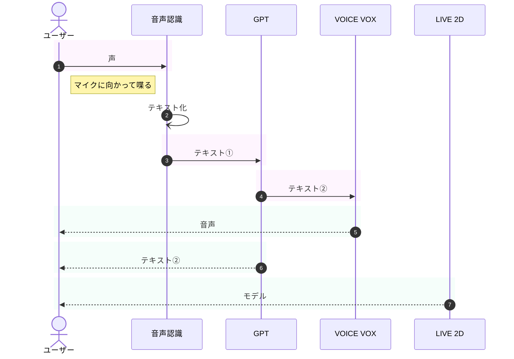

# ailover
課題研究『AI彼氏』用のリポジトリです

## 概要
AIと恋人として会話できるサイトです。

```mermaid
sequenceDiagram
    autonumber
    actor a as ユーザー
    participant voice as 音声認識
    participant output as GPT
    participant audio as VOICE VOX
    participant live as LIVE 2D

    rect rgba(253, 231, 253, 0.4)
    a ->> voice: 声
    end
    Note left of voice:マイクに向かって喋る
    voice -) voice: テキスト化
    rect rgba(253, 231, 253, 0.4)
    voice ->> output: テキスト①
    end
    rect rgba(253, 231, 253, 0.4)
    output ->> audio: テキスト②
    end
    rect rgba(231, 253, 242, 0.4)
    audio -->> a: 音声
    end
    rect rgba(231, 253, 242, 0.4)
    output -->> a: テキスト②
    end
    rect rgba(231, 253, 242, 0.4)
    live -->> a: モデル
    end

    ##253, 231, 253, 0.4 ピンク系
    ##231, 253, 242, 0.4 緑系
    

```