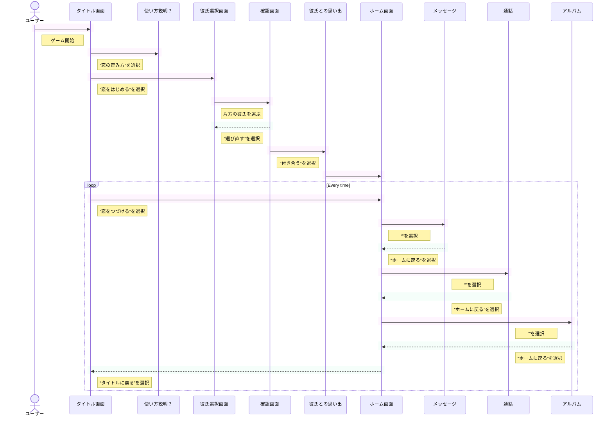

```mermaid
sequenceDiagram
    actor a as ユーザー
    participant title as タイトル画面
    %%　育み方選択部分
    participant setumei as 使い方説明？
    participant select as 彼氏選択画面
    participant kakunin as 確認画面
    participant movie as 彼氏との思い出
    participant home as ホーム画面
    participant line as メッセージ
    participant denwa as 通話
    participant arubamu as アルバム

    %% 以下全部(仮)です。ゲームの流れ的な。
    rect rgba(253, 231, 253, 0.4)    
    a ->> title: 
    end
    Note right of a:ゲーム開始

    rect rgba(253, 231, 253, 0.4)
    title->>setumei:　
    end
    Note right of title:“恋の育み方”を選択

    rect rgba(253, 231, 253, 0.4)
    title->> select:　
    end
    Note right of title:“恋をはじめる”を選択

    rect rgba(253, 231, 253, 0.4)
    select->>kakunin: 
    end
    Note right of select:片方の彼氏を選ぶ

    rect rgba(231, 253, 242, 0.4)
    kakunin-->>select:　
    end
    Note right of select:“選び直す”を選択

    rect rgba(253, 231, 253, 0.4)
    kakunin->>movie: 
    end
    Note right of kakunin:“付き合う”を選択

    rect rgba(253, 231, 253, 0.4)
    movie->>home:　
    end

    loop Every time
    rect rgba(253, 231, 253, 0.4)
    title->>home: 
    end
    Note right of title:“恋をつづける”を選択
    
    rect rgba(253, 231, 253, 0.4)
    home->>line: 
    end
    Note right of home:“”を選択

    rect rgba(231, 253, 242, 0.4)
    line-->>home:　
    end
    Note right of home:“ホームに戻る”を選択

    rect rgba(253, 231, 253, 0.4)
    home->>denwa:　
    end
    Note right of line:“”を選択

    rect rgba(231, 253, 242, 0.4)
    denwa-->>home:　
    end
    Note right of line:“ホームに戻る”を選択

    rect rgba(253, 231, 253, 0.4)
    home->>arubamu: 
    end
    Note right of denwa:“”を選択

    rect rgba(231, 253, 242, 0.4)
    arubamu-->>home: 
    end
    Note right of denwa:“ホームに戻る”を選択

    rect rgba(231, 253, 242, 0.4)
    home-->>title:　
    end
    Note right of title:“タイトルに戻る”を選択
    end


    
```